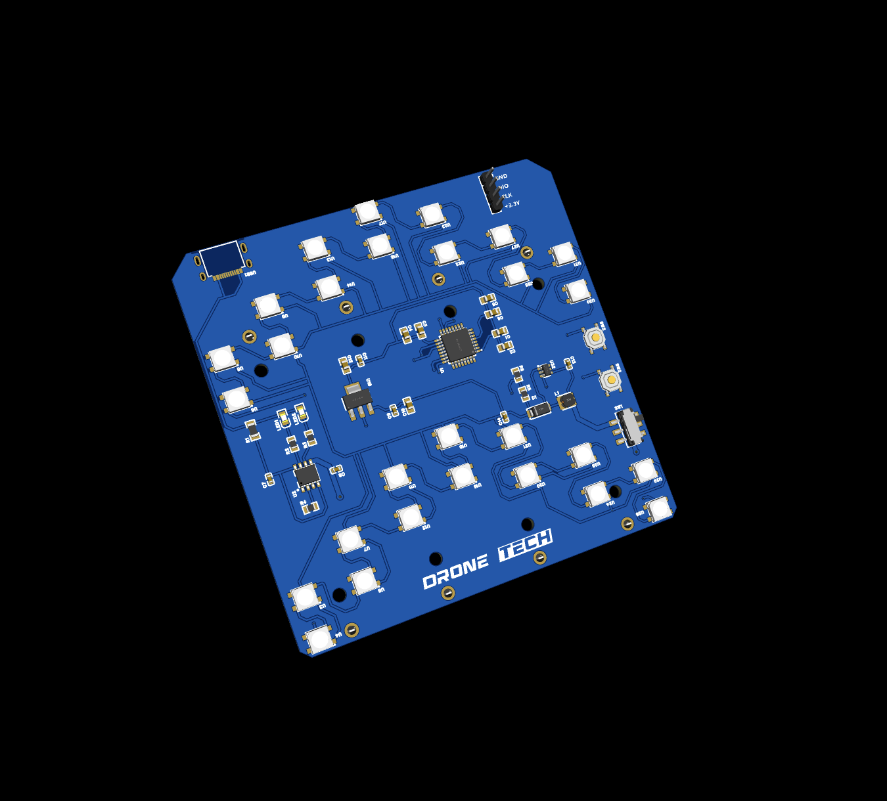
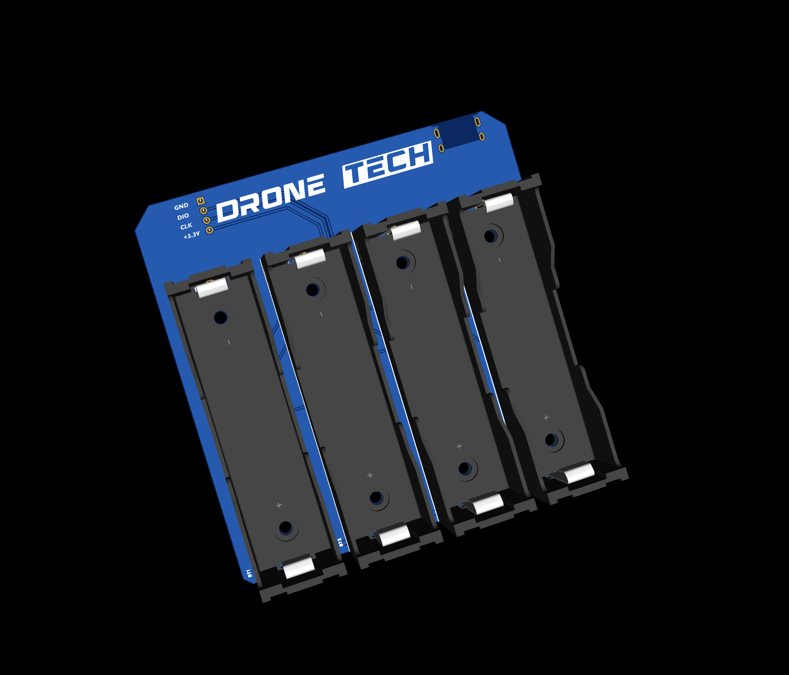

# LED Arrow System

The **LED Arrow** project is a system based on WS2812B LEDs, powered by a 1S4P battery pack (one serial, four parallel 18650 cells) and controlled by the STM32L052K8T6 microcontroller.
### 3D TOP

### 3D BOTTOM

## 📌 Main Features

- **Microcontroller:** STM32L052K8T6  
- **LEDs:** 28 × WS2812B-HS01/W  
- **Power Supply:**
  - Primary: 1S4P (one serial, four parallel 18650 batteries)  
  - MT3608 converter (boosts voltage to 5V)  
  - AMS1117-3.3V for STM32 power  
- **Power Management:** TP4056 with Type-C charging  
- **Communication:** DIO and CLK for microcontroller programming  
- **Buttons:** SW1 for power, SW2 and SW3 for LED mode control  

## 🔧 Future Improvements

- Adding new program of lighting modes.  
- Power consumption optimization.  
- Bluetooth/Wi-Fi control integration.  